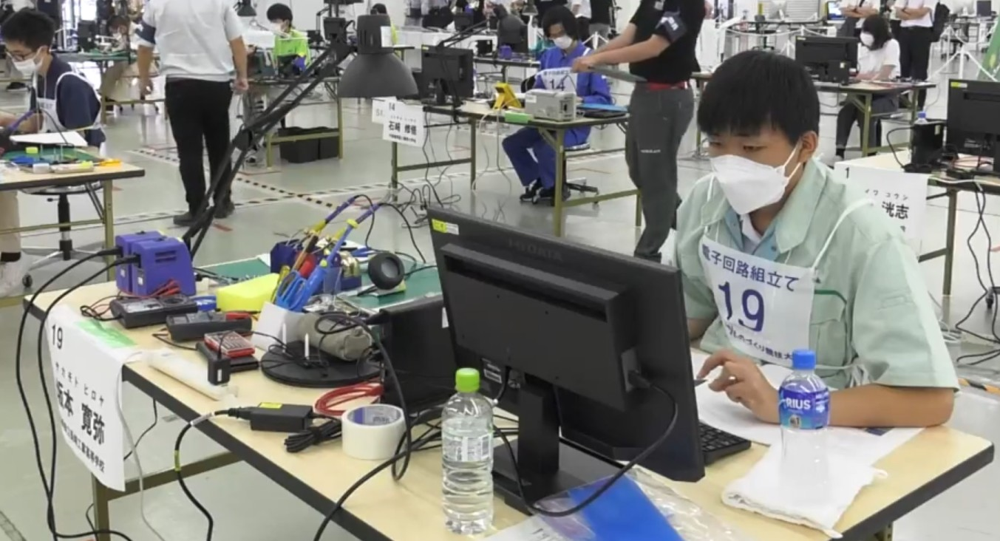
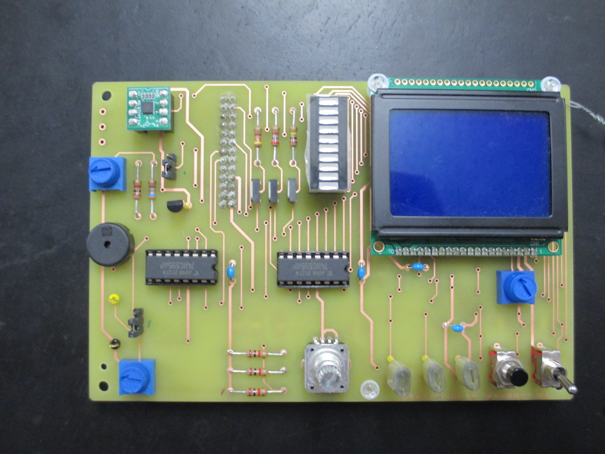
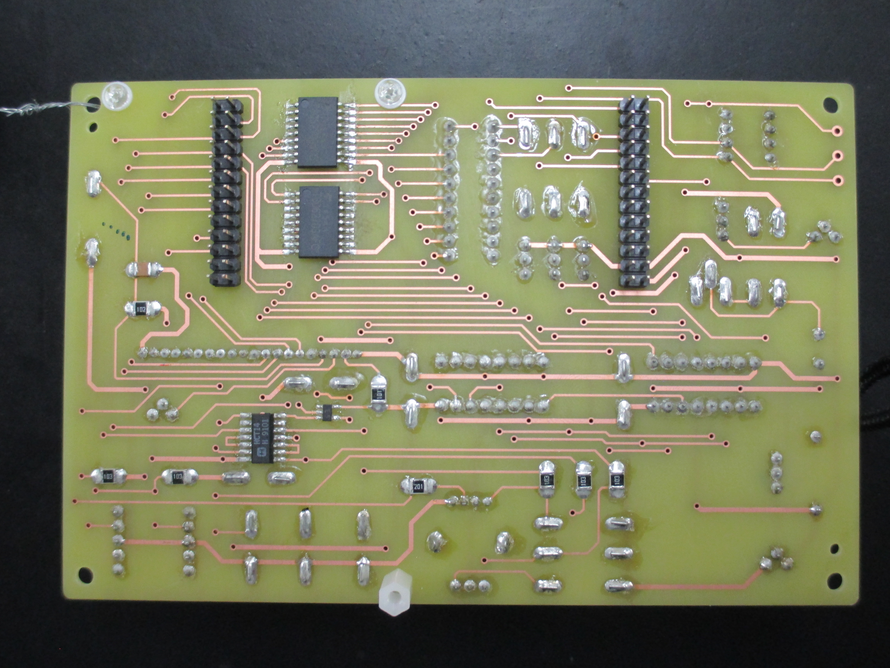

# YouthMonozukuriSkillsCompetition

第17回若年者ものづくり競技大会電子回路組立職種の金賞/厚生労働大臣賞受賞時のソースコードです

## 若年者ものづくり競技大会

若年者ものづくり競技大会とは、就業していない若い技術者が各職種ごとにその技能を競う大会です。

詳しい情報は[公式ホームページ](https://www.javada.or.jp/jyakunen20/)をご覧ください

## 電子回路組立職種

電子回路組立職種は、電子回路の組立と組み込み開発の技術を競う大会です。

制限時間は4時間。この短い時間制限の中で組み立てた電子回路の出来栄えとプログラムの課題を解けた数を競います。

以下の画像は大会の際私が作成した電子回路です。

競技者には事前に本番のものと同じ練習用の電子部品が2回分と、昨年の問題が与えられます。

作成する基盤上の部品の制御方法は事前に確認することができます。

それらの部品の他に、当日に公開される制御対象があります。

今年の当日発表の制御対象は、PCとの無線通信用の部品でした。

詳しい競技内容は[競技課題](document/problem.pdf)をご覧ください。

## ソースコードについて

ソースコードには主催者側が用意したコードと私が当日に記述したコードが混在しています。

### 私が記述したソースコード

以下は私が記述したソースコードです。

- 43行目: `RED`
- 44行目: `GREEN`
- 45行目: `BLUE`
- 49~54行目: プロトタイプ宣言
- 56行目: `map`関数
- 61行目: `write_bar_led_data`関数
- 91行目: `read_analog_value`関
- 102行目: `read_joystick`関数
- 103行目: `glcd_cursor`関数

glcdはGraphical Liquid Crystal Displayの略称とのことです。

glcdから始まる関数の命名方法は主催者側のコードに合わせています。
- 149行目: `glcd_clear_cursor`関数

上記以外のソースコードは大会主催者側が用意し、事前に競技者に共有されるものです。

### 補足情報

ソースコードに含まれる不要に見えるキャストは、大会指定のコンパイラ(C18)の仕様が特殊なため必要です。
このコンパイラでは数値はその値が入る最小の型の値として扱われるため明示的にキャストを行わなければオーバーフローが発生します。

例: `255 * 20`

`255`と`20`は共に`char`型として扱われるため、乗算の結果である`510`が`char`の最大値の`255`を超えオーバーフローします。

## 動作環境

開発環境は事前に公開され、当日は大会の主催者側が用意した環境で開発を行います。

以下は大会当日の開発環境です。

OS: Windows10
IDE: MPLAB X IDE
コンパイラ: C18
マイクロコンピュータ: PIC18F4620
